# 목차

🖋️ 학습목표

5.1 분류와 회귀
* 5.1.1 분류
* 5.1.2 회귀

 

5.2 분류평가지표
* 5.2.1 오차행렬
* 5.2.2 로그손실
* 5.2.3 ROC 곡선과 AUC

 

5.3 데이터 인코딩
* 5.3.1 레이블 인코딩
* 5.3.2 원-핫 인코딩

 

5.4 피쳐스케일링 
* 5.4.1 Min-Max 정규화
* 5.4.2 표준화

 
  
5.5 교차검증
* 5.5.1 K폴드 교차검증
* 5.5.2 층화 K폴드 교차검증

 

5.6 주요 머신러닝 모델
* 5.6.1 선형회귀 모델
* 5.6.2 로지스틱회귀모델
* 5.6.3 결정트리
* 5.6.4 앙상블 학습
* 5.6.5 랜덤포레스트
* 5.6.6 XG Boost
* 5.6.7 Light GBM

 

5.7 하이퍼 파라미터 최적화
* 5.7.1 그리드 서치
* 5.7.2 랜덤서치
* 5.7.3 베이지안 최적화

 

## 5.1 분류와 회귀

### 5.1.1 분류
----------------------------------------------------------
분류 : 타깃값이 범주형 데이터
 

이진분류 : 타깃값이 두개
 

다중분류 : 타깃값이 여러개
 

예시 : 질병의 양성음성구분, 성별구분, 개와고양이의 구분...
 

### 5.1.2 회귀
----------------------------------------------------------
회귀 : 타깃값이 수치형 데이터
 &emsp;&ensp; + 독립변수와 종속변수간의 관계를 모델링 하는것
 

독립변수 : 영향을 주는 변수
 

종속변수 : 영향을 받는 변수
 

예시 : 수면의질이 건강에 미치는 영향 ,  학습시간이 성적에 미치는 영향 ...
 

단순 선형회귀 : Y = θ₀x₁+θ₁x₁
 

다중 선형회귀 : Y = θ₀x₁+θ₁x₁+θ₂x₂
 

기호 : 독립변수 = x, 종속변수 = Y, 회귀계수 = θ
 

목표 : 최적의 회귀모델을 훈련하여 최적의 회귀계수를 추정하는것
 

회귀평가지표 : 회귀모델의 성능측정
 &emsp;&ensp; ▫ MAE(평균절대오차)
 &emsp;&ensp; ▫ MSE(평균제곱오차)
 &emsp;&ensp; ▫ RMSE(평균제곱근오차)
 &emsp;&ensp; ▫ MSLE(평균제곱로그오차)
 &emsp;&ensp; ▫ RMSLE(평균제곱근로그오차)
 &emsp;&ensp; ▫ R²
 

상관계수 : 두변수(종속,독립)의 상관관계정도를 수치로 나타낸값
  r = -1&emsp; -1<r<0 &emsp;r=0&emsp; <r<1 &emsp; r=1
  
강한음의상관관계

|r = -1        |-1<r<0   |r=0     |<r<1     |r=1           |
|--------------|---------|--------|---------|--------------|
|강한 음의 관계|음의 관계|관계없음|양의 관계|강한 양의 관계|

## 5.2 분류평가지표

### 5.2.1 오차행렬
----------------------------------------------------------
오차행렬 : 실제 타깃값과 예측 타깃값이 어떻게 매칭되는지를 보여주는 표
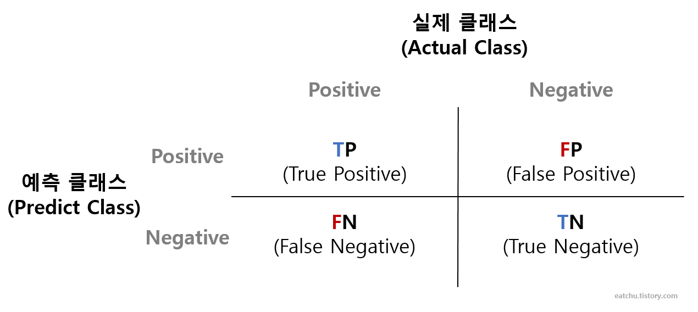
➡ 오차행렬표를 기반으로 분류 평가지표를 구할수 있다.

i) 정확도(accuracy) : 실제값과 예측값이 `얼마나일치하는지`를 비율로 나타낸 평가지표.
 &emsp;&emsp;비고 : 정확도는 평가지표로 자주 쓰이지 않음. 
 &emsp;&emsp;수식 : 
 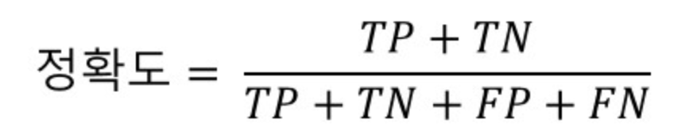
 

ii) 정밀도(precision) : 양성예측의 정확도(`예측정확도`)
 &emsp;&emsp;비고 : 음성을 양성으로 잘못 판단하면 문제가 생기는곳에 사용.
 &emsp;&emsp;예시 : 스팸메일 필터링 
 &emsp;&emsp;&emsp;&emsp;&ensp; - 업무용 일반메일을 스팸메일로 판단할경우 훨씬 큰 문제가 되기때문
 &emsp;&emsp;수식 : 
 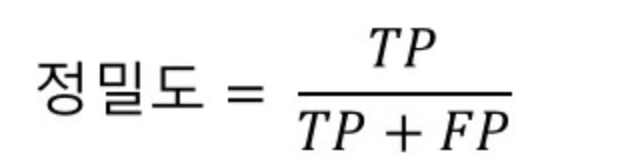
 &emsp;&emsp;기본 : 문제가되는상태 = 양성 , 
 &emsp;&emsp;&emsp;&emsp;&emsp;정상인상태 = 음성 ,
 

iii) 재현률(recall) : 실제 양성값중 잘 예측한(참양성)값의 비율
 &emsp;&emsp;비고 : 양성을 음성으로 잘못 판단하면 문제가 생기는곳에 사용.(정밀도와는 반대의경우에 사용)
 &emsp;&emsp;예시 : 의사의 암진단
 &emsp;&emsp;&emsp;&emsp;&ensp; - 암(양성)인데 아니라고(음성) 진단하면 훨씬 문제가 되기때문.
 &emsp;&emsp;수식 : 
 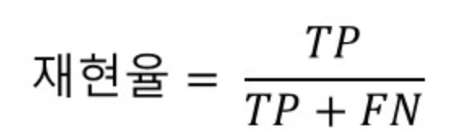
 

iv) F1점수 : 정밀도와 재현률을 조합한 평가지표
 &emsp;&emsp;비고 : 수식은 조화평균으로 구함
 &emsp;&emsp;수식 : 
 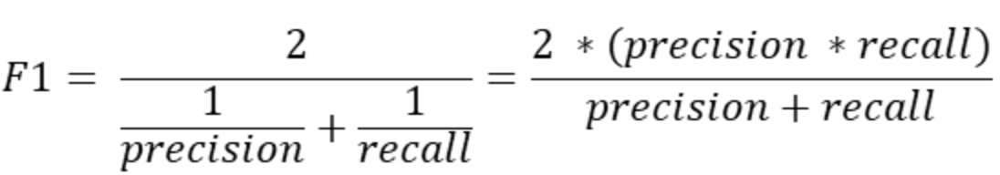
 

### 5.2.2 로그손실
----------------------------------------------------------
로그손실 : `분류문제`에서 타깃값을 `확률`로 예측할때 `기본적으로`사용하는 평가지표
 &emsp;&emsp;비고 : 실제 타깃값과 예측 타깃확률의 손실이 작을수록 좋다
 &emsp;&emsp;예시 : 
 
&emsp;&emsp;&emsp;&emsp;샘플A - 실제 타깃값(1,0,1) 예측타깃확률(0.9,0.1,0.8) 
 
&emsp;&emsp;&emsp;&emsp;샘플B - 실제 타깃값(1,0,1) 예측타깃확률(0.4,0.7,0.5) 
 &emsp;&emsp;평가 : 샘플A가 샘플B보다 타깃확률의 손실이 적어서 모델성능이 더 뛰어나다.

### 5.2.3 ROC곡선과 AUC면적
----------------------------------------------------------
ROC곡선 : 참양성비율(TPR)에대한 거짓양성비율(FPR)의 곡선
 
AUC면적 : RPC곡선 아래의 면적, 값이 클수록 모델 성능이 좋다.
 
&emsp;&emsp;&emsp;&ensp; + 예측값이 `확률`인 분류문제에 사용된다.
 
분류평가지표 구분:
 
&emsp;&emsp;&emsp;&ensp; `타깃값` 으로 예측시 :정확도,정밀도,재현율,F1점수
 
&emsp;&emsp;&emsp;&ensp; `타깃확률`로 예측시 : 손실함수,AUC면적
 
TPR(참양성비율) : 양성을 얼마나 정확히 예측하는지 나타내는 지표,(=재현율,민감도)
 
TNR(참음성비율) : 음성을 얼마나 정확히 예측하는지 나타내는 지표,(=특이도)
 
FPR(거짓양성비율) : 1-TNR(특이도)
 
ROC곡선 : `TPR`(민감도)에 대한 `FPR`(1-TNR(특이도))곡선
 
 
설명 : 점선은 무작위분류, 점선에 가까울수록 성능이 떨어지고,
 
&emsp;&emsp;&emsp;AUC의 면적이 클수록 성능이 좋다.
 
&emsp;&emsp;&emsp;성능은 빨강 > 파랑 > 검정 순
 
&emsp;&emsp;&emsp;다시말해 100% 완벽하다면 AUC는 1이고 무작위 분류시 AUC는 0.5가 된다.
 

## 5.3 데이터 인코딩
범주형 데이터를 숫자로 만드는 작업
 
&emsp;&emsp; + 숫자형 데이터도 성능향상을 위해 인코딩할때도 있음

### 5.3.1 레이블 인코딩
----------------------------------------------------------
레이블 인코딩 : 범주형 데이터를 숫자형으로 일대일 대응하는 인코딩 방식
 
예시 : 
 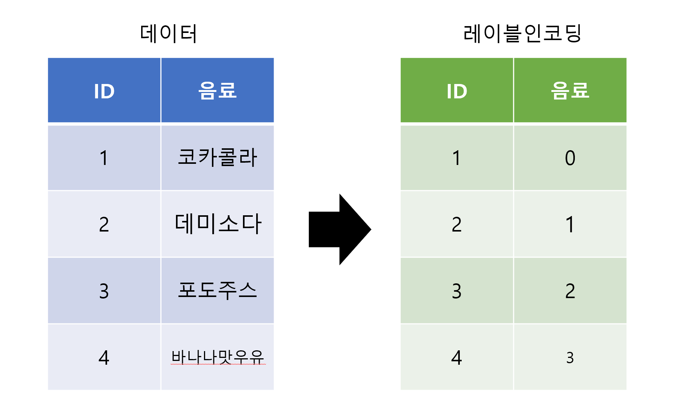

### 5.3.2 원-핫 인코딩
----------------------------------------------------------
원-핫 인코딩 : 여러값중 하나만 활성화 시키는 인코딩 방식
 
예시 : 
 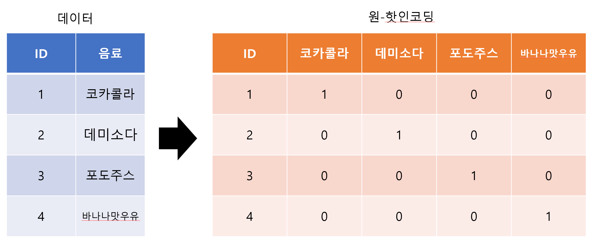

## 5.4 피쳐스케일링
개요 : 서로다른 피쳐값의 범위(최대값,최솟값)가 일치하도록 조정하는 작업
 
비고 : 값의 범위가 데이터 마다 다르면 모델훈련이 제대로 안되기때문에 피쳐스케일링 작업을 한다.
 

### 5.4.1 Min-Max 정규화
----------------------------------------------------------
Min-Max 정규화 : 피쳐값의 범위를 0~1로 조정하는 기법
 
수식 : 
 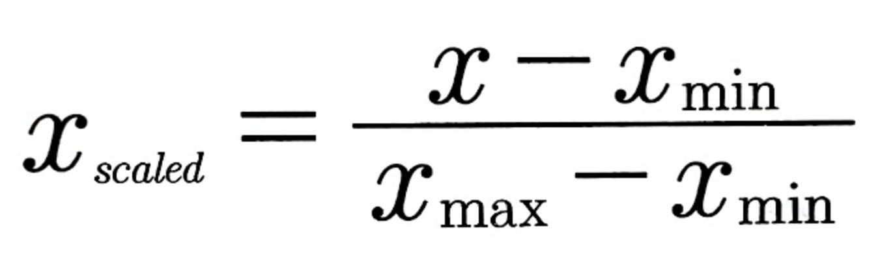

### 5.4.2 표준화
----------------------------------------------------------
표준화 : 평균이 0, 분산이 1이 되도록 조정하는 기법
 
수식 : 
 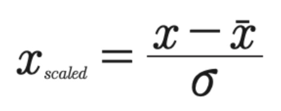

## 5.5 교차검증

개요 : 훈련그룹을 여럿 나누어서 일부는 훈련시 사용하고,
일부는 검증시 사용해서 모델 성능을 측정하는 기법
 

교차검증 하는이유 : 
 &emsp;&emsp;&emsp;1. 모델의 과대적합 가능성 방지
 &emsp;&emsp;&emsp;2. 제출전의 모델 성능 확인

### 5.5.1 K폴드 교차검증
----------------------------------------------------------
그림 : 
 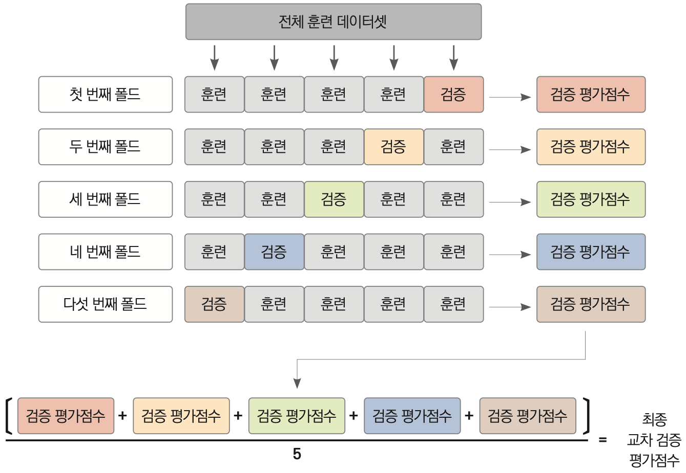
 
순서 : 
 &emsp;&emsp;&emsp;1. 전체 훈련데이터를 K개 그룹으로 나눈다.
 &emsp;&emsp;&emsp;2. 그룹1개를 검증용 데이터로, 나머지는 훈련용 데이터로 지정한다.
 &emsp;&emsp;&emsp;3. 훈련데이터 => 모델훈련 
||  검증데이터 => 검증평가
 &emsp;&emsp;&emsp;4. 평가점수 기록
 &emsp;&emsp;&emsp;5. 검증데이터를 다른 그룹으로 바꾸면서 1~4번 반복
 &emsp;&emsp;&emsp;6. K개 검증평가 점수의 평균을 도출

실습코드링크 : [K폴드 교차검증](URL)

### 5.5.2 층화 K폴드 교차검증
----------------------------------------------------------
층화 K폴드 교차검증 : 타깃값이 불균형하게 분포되어있는 경우 사용3
 &emsp;&emsp;&emsp;&emsp;&emsp;&emsp;&emsp;&emsp;
&ensp;+ 특정 타깃값이 다른 타깃값보다 굉장히 작을때 사용가능
 
그림 : 
 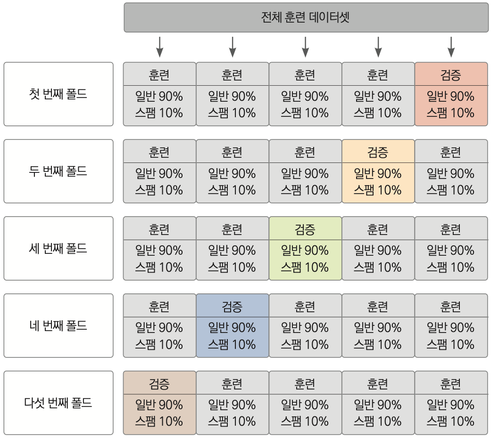  

 
예시 :  받은 메일이 1000개인데 스팸메일은 소량인 10개인경우
 

사용이유 : 특정 그룹에 스팸메일이 없을수 있으므로 스팸 데이터 없이 모델링을 돌릴 경우 스팸메일 예측을 제대로 할수 없기 때문

실습코드링크 : [층화 K폴드 교차검증](URL)

## 5.6 주요 머신러닝 모델

### 5.6.1 선형회귀 모델
----------------------------------------------------------
실습코드링크 : [선형회귀](URL)
 

### 5.6.2 로지스틱 회귀 모델
----------------------------------------------------------
실습코드링크 : [로지스틱 회귀](URL)
 

### 5.6.2 결정트리
----------------------------------------------------------
실습코드링크 : [결정트리](URL)
 

### 5.6.2 앙상블 학습
----------------------------------------------------------
a) 보팅
1. 하드보팅
  
실습코드링크 : [하드보팅](URL)
  
1. 소프트보팅
  
실습코드링크 : [소프트보팅](URL)
 

b) 배깅
  
실습코드링크 : [배깅](URL)
 
c) 부스팅
  
실습코드링크 : [부스팅](URL)
 

### 5.6.2 랜덤 포레스트
----------------------------------------------------------
실습코드링크 : [랜덤 포레스트](URL)
 

### 5.6.2 XG Boost
----------------------------------------------------------
실습코드링크 : [XG Boost](URL)
 

### 5.6.7 LightGBM
----------------------------------------------------------
실습코드링크 : [LightGBM](URL)
 

## 5.7 하이퍼 파라미터 최적화

### 5.7.1 그리드 서치
----------------------------------------------------------
그리드 서치 : 주어진 하이퍼 파라미터를 모두 순회하며 가장 좋은 성능을 내는 값을 찾는 방식
 
단점 : 무작위 라는점 때문에 그리드서치나 베이지안 최적화보다 사용빈도가 떨어짐

실습코드링크 : [그리드서치](URL)

### 5.7.2 랜덤서치
----------------------------------------------------------
랜덤서치 : 하이퍼 파라미터를 무작위로 탐색하여 가장 좋은 성능을 내는 값을 찾는 방식
 
단점 : 시간이 오래 걸린다.

실습코드링크 : [랜덤서치](URL)

### 5.7.3 베이지안 최적화
----------------------------------------------------------
베이지안 최적화 : 코드가 직관적이며, 사전정보를 바탕으로 최적 하이퍼 파라미터값을 확률적으로 추정하며 탐색하는 기법.
 

장점 : 그리드서치나 랜덤서치보다 최적하이퍼파라미터를 더 빠르고 효율적으로 찾아준다.

실습코드링크 : [베이지안 최적화](URL)
